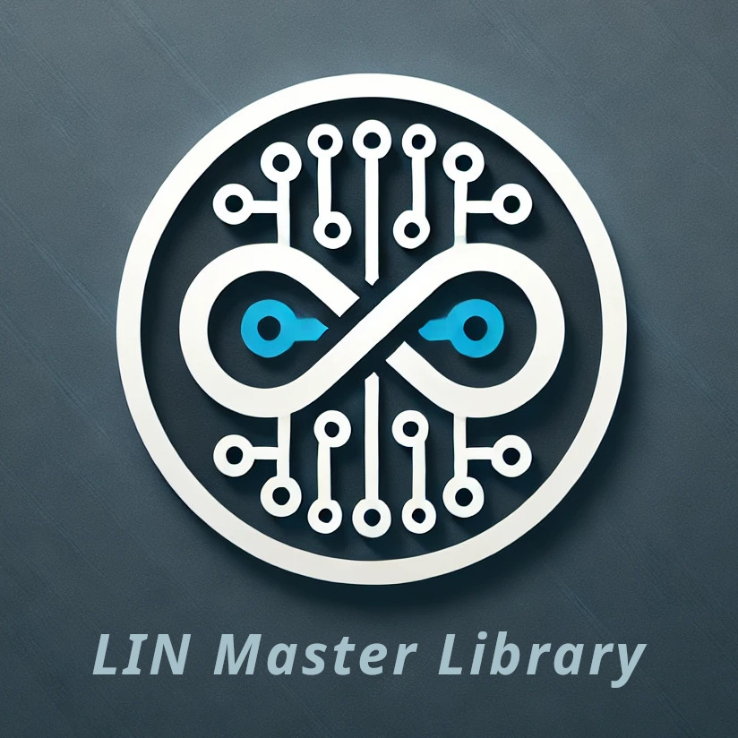

  

Portable LIN Master Node Emulation
==================================

[Doxygen docs](https://gicking.github.io/LIN_master_portable_Arduino/extras/documentation/html/index.html)

# Introduction

This Arduino library implements a Local Interconnect Network master node emulation. For an explanation of the LIN bus and protocol e.g. see https://en.wikipedia.org/wiki/Local_Interconnect_Network.

Optionally LIN protocoll via RS485 is supported (see respective examples). In this case Rx-enable (=RE) must be statically enabled to receive LIN echo, and Tx-enable (=DE) is controlled by the Arduino. 

The class structure is very flexible and aims at supporting different Serial interfaces and architectures. It can easily be ported to other boards - in which case a pull request is highly appreciated... 

For a similar Arduino libary for LIN slave emulation see https://github.com/gicking/LIN_slave_portable_Arduino

## Supported functionality
  - blocking and non-blocking operation
  - multiple, simultaneous LIN nodes
  - supports HardwareSerial and SoftwareSerial
  - supports LIN protocoll via RS485 with Tx direction switching
  
## Supported Boards (with additional LIN hardware)
  - AVR boards, e.g. [Arduino Uno](https://store.arduino.cc/products/arduino-uno-rev3), [Mega](https://store.arduino.cc/products/arduino-mega-2560-rev3) or [Nano](https://store.arduino.cc/products/arduino-nano)
  - ATtiny boards, e.g. [Adafruit Trinket](https://www.adafruit.com/product/1501) (only SoftwareSerial)
  - SAM boards, e.g. [Arduino Due](https://store.arduino.cc/products/arduino-due)
  - ESP32 boards, e.g. [Espressif Wroom-32U](https://www.etechnophiles.com/esp32-dev-board-pinout-specifications-datasheet-and-schematic/) 
  - ESP8266 boards, [Wemos D1 mini](https://www.wemos.cc/en/latest/d1/d1_mini.html)

## Notes
  - The sender state machine relies on reading back its 1-wire echo. If no LIN or K-Line transceiver is used, connect Rx&Tx (only one Tx to avoid damage)
  - For background operation, the `handler()` method must be called at least every 500us, especially after initiating a frame. Optionally it can be called from within [serialEvent()](https://reference.arduino.cc/reference/de/language/functions/communication/serial/serialevent/)
  

# Test Matrix (v1.6)

An *ok* in the below test matrix indicates that normal master request frames are sent, slave responses are received and bus disconnection is detected (-> error). Also, code execution starts with only external supple, i.e. USB not connected. No extensive testing of *all* possible error cases was performed. Please let me know if you experience unexpected errors.

Logic analyzer screenshots of LIN bus, idle pin and error pin levels are stored in folder "./extras/testing/*Board*"

Have fun!, Georg

----------------

Revision History
----------------

**v1.6 (2025-04-27)**
  - for clarity add "this->" for all internal method calls and class variable access  
  - re-test v1.6 and add some comments
  - update reference

**v1.5 (2025-04-26)**
  - add optional timeout to debug Serial begin(). Is relevant for native USB ports if no USB is connected

**v1.4 (2025-01-26)**
  - replace `*Stream` in LIN base class by actual serial interface to reduce overhead
  - add library reference via [Doxygen](https://www.doxygen.nl/)
  - increase frame timeout to handle slow slave responses
  - improve CI test coverage via Github Actions
  - performed recursion tests in above test matrix

**v1.3 (2024-12-14)**
  - add support for LIN protocol via RS485 PHY
  - add Github Actions for CI tests  
  - add more examples  
  - increase test coverage  

**v1.2 (2023-06-02)**
  - Make SoftwareSerial optional for ESP32 to avoid library issue
  - add examples & increase test coverage for more boards  

**v1.1 (2022-12-10)**
  - minor cosmetic changes and bugfixes
  - changed name to meet Arduino naming conventions. Specifically omit "(" and ")"

**v1.0 (2022-12-10)**
  - initial release
  - supersedes less portable [LIN master library](https://github.com/gicking/LIN_master_Arduino)

