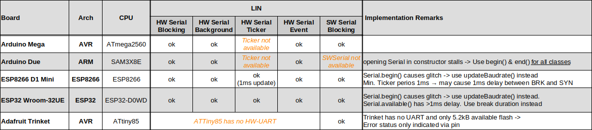

Portable LIN Master Node Emulation
==================================

This Arduino library implements a Local Interconnect Master node emulation. For an explanation of the LIN bus and protocol e.g. see https://en.wikipedia.org/wiki/Local_Interconnect_Network.

The class structure is very flexible and aims at supporting different Serial interfaces and architectures. It can easily be ported to other boards - in which case a pull request is highly appreciated... 

**Supported functionality:**
  - blocking and non-blocking operation
  - multiple, simultaneous LIN nodes
  - supports HardwareSerial and SoftwareSerial, if available
  
**Supported Boards (with additional LIN hardware):**
  - AVR boards, e.g. [Arduino Uno](https://store.arduino.cc/products/arduino-uno-rev3), [Mega](https://store.arduino.cc/products/arduino-mega-2560-rev3) or [Nano](https://store.arduino.cc/products/arduino-nano)
  - ATtiny boards, e.g. [Adafruit Trinket](https://www.adafruit.com/product/1501)
  - SAM boards, e.g. [Arduino Due](https://store.arduino.cc/products/arduino-due)
  - ESP32 boards, e.g. [Espressif Wroom-32U](https://www.etechnophiles.com/esp32-dev-board-pinout-specifications-datasheet-and-schematic/) 
  - ESP8266 boards, [Wemos D1 mini](https://www.wemos.cc/en/latest/d1/d1_mini.html)
  
**Test Matrix:**

**Notes:**
  - The sender state machine relies on reading back its 1-wire echo. If no LIN or K-Line transceiver is used, connect Rx&Tx (only on same device!)
  - for background operation, the `handler()` method must be called at least every 1ms, especially after initiating a frame

Have fun!, Georg
